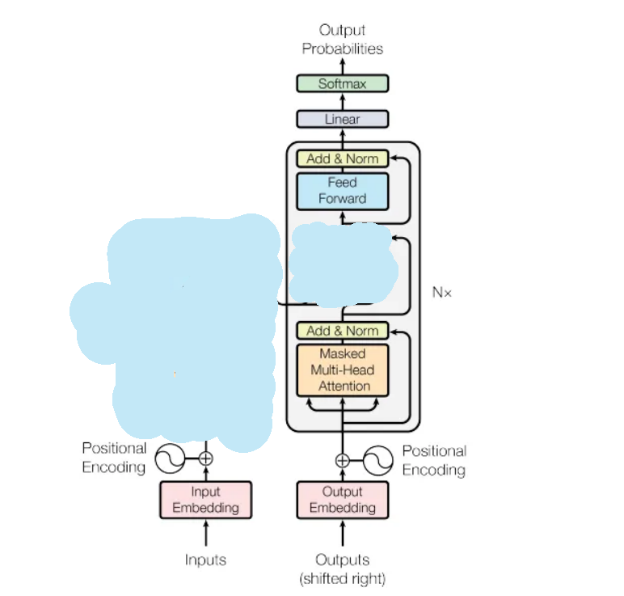
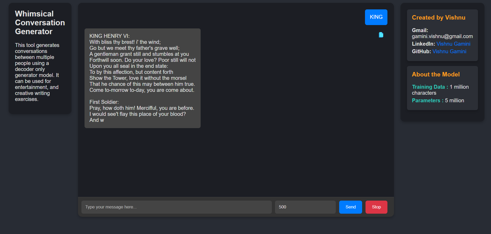

# WhimsyChat

WhimsyChat is a custom decoder-only transformer model inspired by paper ["Attention is All You Need"](https://arxiv.org/abs/1706.03762). It generates hilarious and whimsical content between personas of itself. By providing it with context, the model continues to augment those words, creating engaging and entertaining dialogues.

## How It Works

WhimsyChat adopts the transformer architecture's decoder component, focusing on self-attention mechanisms to generate the next token based on the sequence of previous tokens. By recursively feeding all tokens back into itself, the model effectively models long-range dependencies and maintains contextual coherence in its outputs.

- **Self-Attention Mechanism**: Allows the model to weigh the importance of different tokens in the input sequence when generating the next token.
- **Recursive Token Feeding**: Each generated token is fed back into the model, enabling it to build upon the existing context.
- **Context Maintenance**: Through `token embeddings` and `positional embeddings`, the model understands not just the words themselves but also their position in the sequence.

## Architecture
 

## Features

- **Decoder-Only Transformer Architecture**: Leverages principles from "Attention is All You Need," focusing on the **decoder part** of the transformer to generate text.
- **Recursive Token Feeding**: Feeds all tokens back into itself to produce the next token, ensuring coherent and contextually relevant output.
- **Token and Positional Embeddings**: Uses token embeddings and positional embeddings to maintain context and understand the sequence of words.
- **Customizable Token Generation**: Allows users to specify the number of tokens to generate, offering control over the length and depth of the generated content.
- **Interactive Frontend**: Comes with a beautifully designed interactive frontend for seamless user engagement.

## Installation

1. **Clone the Repository**:

    ```sh
    git clone https://github.com/vishnugamini/WhimsyChat.git
    ```

2. **Navigate to the Project Directory**:

    ```sh
    cd WhimsyChat-main
    ```

3. **Run the Application**:

    ```sh
    python app.py
    ```

4. **Launch the Frontend**:

    - Open `index.html` in your preferred web browser.

## Usage

- Provide context to the model, and it will generate augmented content based on that context.
- Specify the number of tokens you want the model to generate for customized output length.

## Model Information

- Trained on 1 million characters.
- Contains 5 million trainable parameters.
- Context window : 256 tokens

## Reference

[](https://vimeo.com/993884106)


